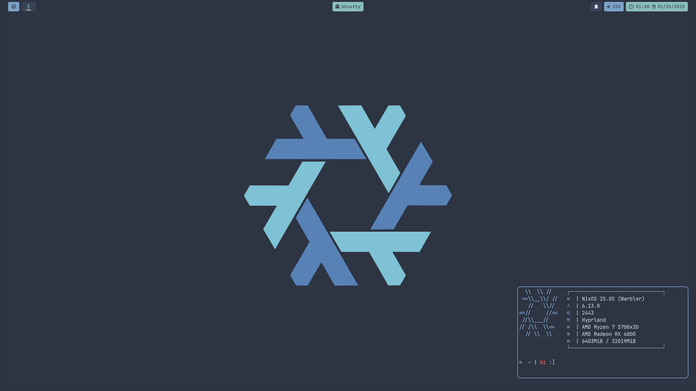
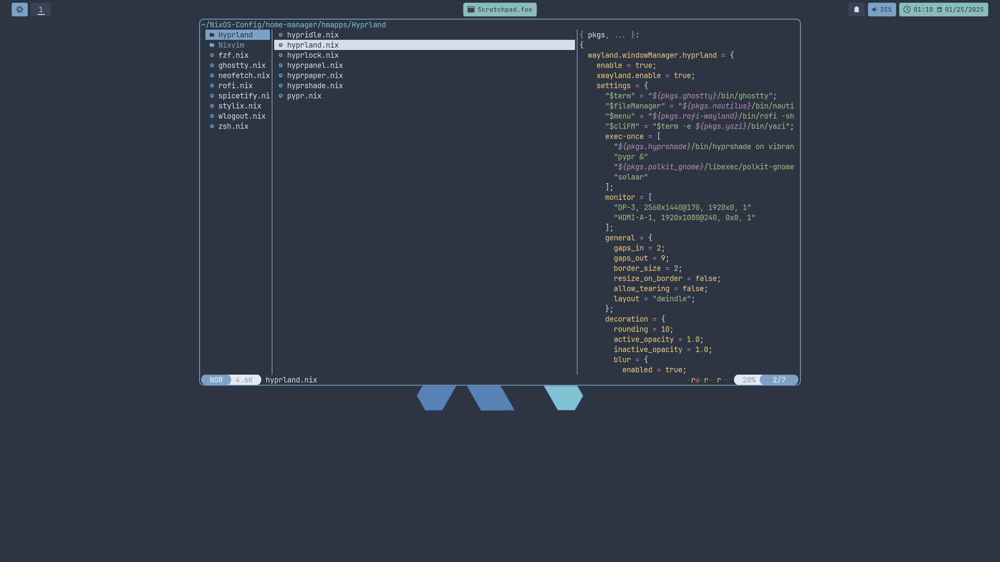
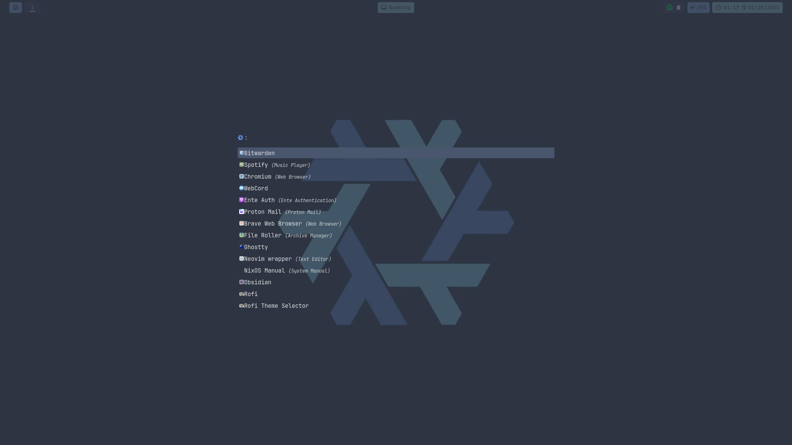
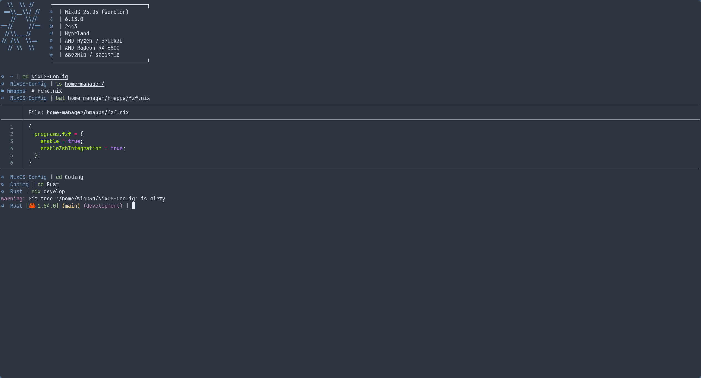
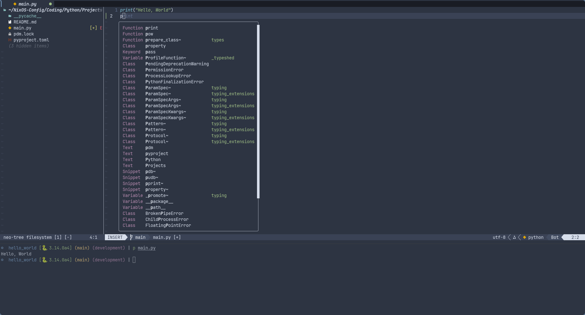
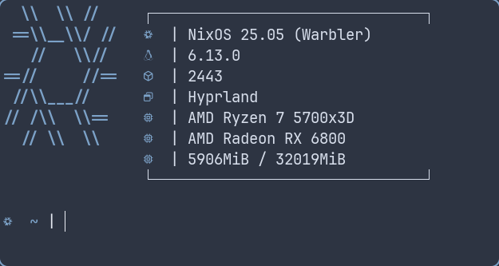
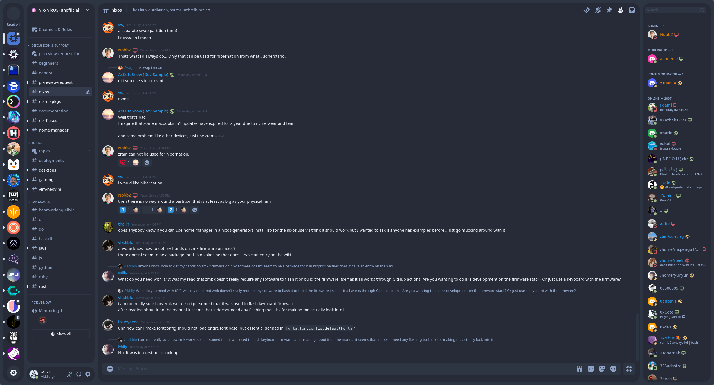
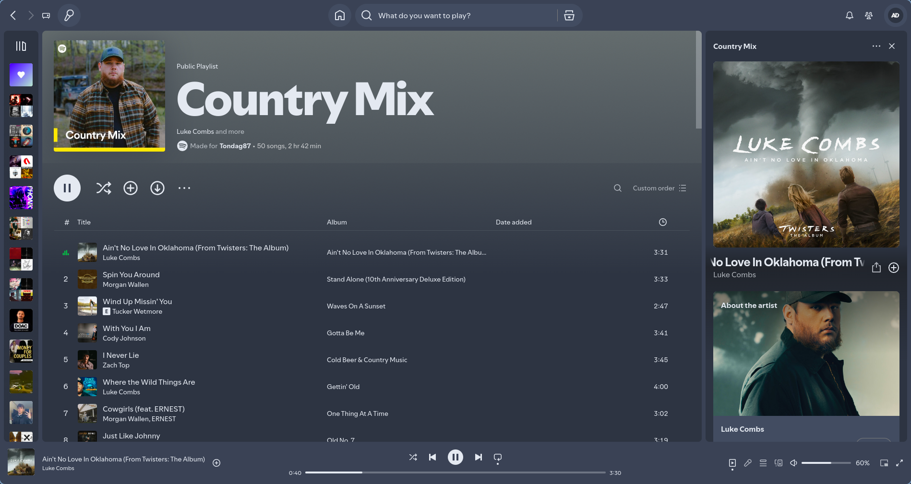

<div align="center">

</div>
<p align="center"><h1 align="center">Nixpocalypse</h1></p>
<p align="center">
	
	
	
</p>

## Dotfiles For My NixOS Configuration

### ❌ I WON’T BE PROVIDING INSTALLATION SUPPORT FOR THIS; STEAL THE CODE, THIS IS TOO SELF-CENTERED TO ME AND MY USE CASE

---

### Filetree

```bash

Coding/
Downloads/
Screenshots/

flake.nix

nixos/
├── configuration.nix
├── disko.nix
└── hardware-configuration.nix

home-manager/
├── hmapps
│   ├── fzf.nix
│   ├── ghostty.nix
│   ├── Hyprland
│   │   ├── hypridle.nix
│   │   ├── hyprland.nix
│   │   ├── hyprlock.nix
│   │   ├── hyprpanel.nix
│   │   ├── hyprpaper.nix
│   │   ├── hyprshade.nix
│   │   └── pypr.nix
│   ├── neofetch.nix
│   ├── Nixvim
│   │   ├── keys.nix
│   │   ├── nixvim.nix
│   │   ├── plugins
│   │   │   ├── bufferline.nix
│   │   │   ├── cmp.nix
│   │   │   ├── conform.nix
│   │   │   ├── copilot.nix
│   │   │   ├── cursorline.nix
│   │   │   ├── fidget.nix
│   │   │   ├── git.nix
│   │   │   ├── harpoon.nix
│   │   │   ├── lint.nix
│   │   │   ├── lsp.nix
│   │   │   ├── lspsaga.nix
│   │   │   ├── lualine.nix
│   │   │   ├── luasnip.nix
│   │   │   ├── markdown.nix
│   │   │   ├── neo-tree.nix
│   │   │   ├── noice.nix
│   │   │   ├── none-ls.nix
│   │   │   ├── nvim-notify.nix
│   │   │   ├── obsidian.nix
│   │   │   ├── telescope.nix
│   │   │   ├── treesitter.nix
│   │   │   └── undotree.nix
│   │   └── sets.nix
│   ├── rofi.nix
│   ├── spicetify.nix
│   ├── stylix.nix
│   ├── wlogout.nix
│   └── zsh.nix
└── home.nix
```

### Screenshots

---

#### Window Manager

Hyprland: Animation Heaven



Scratchpads: Yazi, Spare Terminal, and Volume Manager



---

#### Rofi

Rofi: App-Launcher, Fullscreen for easy selection



---

#### Ghostty

Ghostty: The hype train has arrived



---

#### Nixvim

Nixvim: Nix decloration for Neovim, Honestly surprised at the simplicity, though massive thanks to [Elythh](https://github.com/elythh/nixvim)



---

#### Neofetch

Notice: I know its deprecited I just really don't care 🤡



---

#### Webcord

Colorscheme located in Downloads/ Using Webcord with Vencord



---

#### Spotify

Sloppy Colorscheme produced by Stylix, good enough for me though


